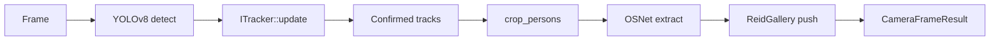
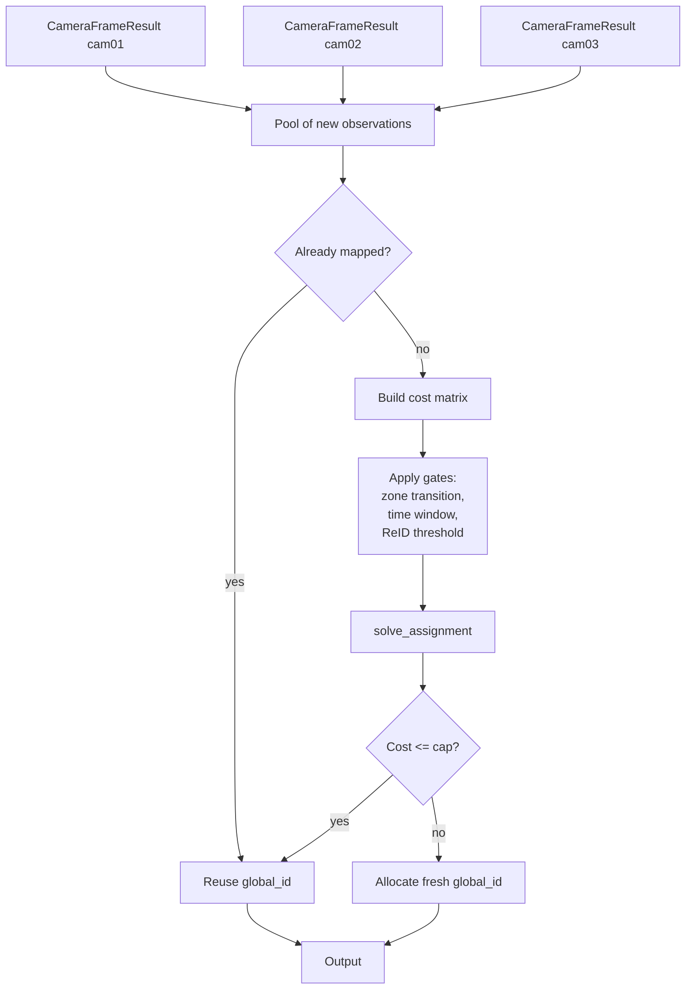

# Architecture

Two layers, separated cleanly so each can be swapped:

1. **Per camera** - YOLOv8 -> tracker -> ReID, sequential per frame.
2. **Across cameras** - IdentityMatcher consumes per-camera snapshots
   and produces stable global ids.

## Per-camera flow

The `ITracker` abstraction lets `bytetrack`, `iou`, or `nvdcf` be
swapped via `tracker.type` in YAML without touching the rest of the
pipeline.

## Cross-camera matching

## Why per-track galleries

A person walking across a camera produces dozens of bounding boxes;
the embeddings are not equivalent. The first 5 may be face-on, the
next 5 facing away. Average them and you get a vector that matches
neither view well.

The fix is a small rolling bank per track (default 8 entries).
Cross-camera matching takes the *max* cosine over the bank rather
than against a single canonical embedding. In our experience this is
the single biggest contributor to matching robustness; throwing away
the bank costs ~10% recall on transitions where the person turns.

## Threading

The OpenCV-only driver is single-threaded: cameras are processed
sequentially per frame. The DeepStream variant (when built) gives
each `nvurisrcbin` its own decoder thread; the orchestrator's
`stamp_global_ids` runs on whichever thread the probe fires on, so
keep the matcher fast.

`IdentityMatcher` itself is currently *not* thread-safe; the
orchestrator serialises calls. Multi-process deployments need a
shared store for `globals_` (Redis or a small SQLite).

## Failure modes

- **Track ID reset on tracker.** When the per-camera tracker drops
  a track and reacquires it later (occlusion exceeds
  `track_buffer`), the new local_id is treated as a fresh
  observation. The matcher then has to look it up against the
  global pool, which usually succeeds because the person's
  appearance is unchanged. If the gallery is too aggressive an
  evictor (`gallery_size_per_track` too small), the historical
  embedding is gone by then and you get a duplicate global_id.
- **Two cameras observe the same instant.** The
  `spatial_overlap_window_ms` allows this only when the time delta
  is positive; observations arriving out of order will be flagged
  as transitions in the wrong direction. Sync your camera clocks.
- **Single camera dominates.** When one camera produces 80% of all
  observations, the canonical embedding for every global id is
  effectively the most recent observation on that camera. Keep an
  eye on per-camera contribution and consider weighting the
  canonical embedding update.
